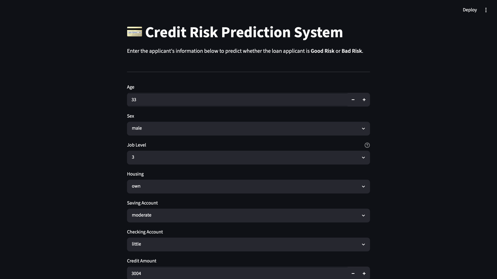
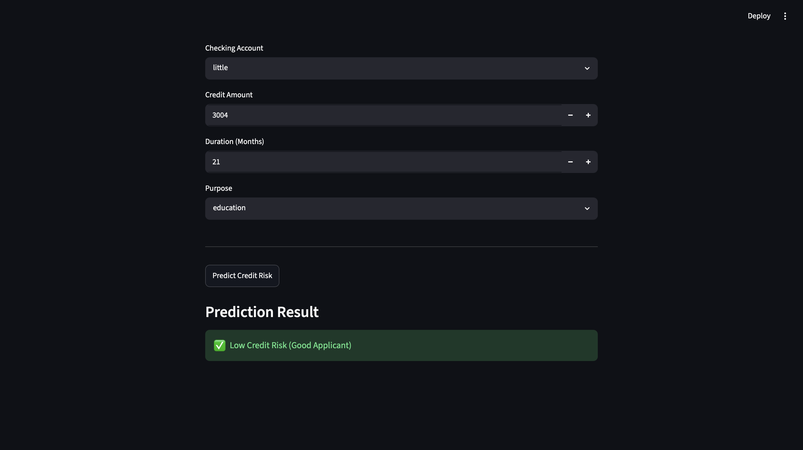

# 💳 Credit Risk Prediction System


An end-to-end Machine Learning project that predicts whether a loan applicant is a **Good Risk** or **Bad Risk** based on demographic and financial information. The project covers the complete machine learning lifecycle, from exploratory data analysis and preprocessing to model deployment through an interactive Streamlit application.

---

## 📸 Application Preview

### Home Page

<p align="center">
  
</p>

### Prediction Result

<p align="center">
  
</p>

---

# 📌 Project Overview

Credit risk assessment is one of the most important tasks in banking and financial services. Incorrect lending decisions can lead to significant financial losses.

This project develops a machine learning model capable of classifying loan applicants into **Good Risk** and **Bad Risk** categories using customer demographics, financial history, and loan-related information.

The project includes:

- Exploratory Data Analysis (EDA)
- Data Cleaning & Missing Value Handling
- Feature Encoding using ColumnTransformer
- Machine Learning Model Development
- Hyperparameter Tuning using GridSearchCV
- Model Evaluation
- Feature Importance Analysis
- Interactive Streamlit Application
- Git Version Control & GitHub Deployment

---

# 📂 Dataset

**Dataset:** German Credit Dataset

- 1000 customer records
- Binary Classification Problem
- Target Variable:
  - Good Risk
  - Bad Risk

### Features

- Age
- Sex
- Job
- Housing
- Saving Account
- Checking Account
- Credit Amount
- Loan Duration
- Loan Purpose

---

# 🔄 Machine Learning Workflow

```text
German Credit Dataset
          │
          ▼
Exploratory Data Analysis
          │
          ▼
Data Cleaning & Missing Value Handling
          │
          ▼
Train-Test Split
          │
          ▼
ColumnTransformer
          │
          ▼
Pipeline
          │
          ▼
Model Training
          │
          ▼
Random Forest
Extra Trees
XGBoost
          │
          ▼
GridSearchCV
          │
          ▼
Feature Importance Analysis
          │
          ▼
Streamlit Deployment
```

---

# ⚙️ Tech Stack

### Programming Language

- Python

### Libraries

- Pandas
- NumPy
- Scikit-learn
- XGBoost
- Matplotlib
- Seaborn
- Joblib
- Streamlit

### Tools

- Jupyter Notebook
- VS Code
- Git
- GitHub

---

# 🤖 Models Implemented

The following classification models were trained and evaluated:

- Random Forest Classifier
- Extra Trees Classifier
- XGBoost Classifier

The final deployed model is a **Random Forest Classifier** optimized using **GridSearchCV**.

---

# 📊 Model Performance

| Model | Accuracy |
|--------|----------|
| Random Forest | **75.5%** |
| Extra Trees | **72.5%** |
| XGBoost | **76.5%** |
| Tuned Random Forest | **77.5%** |

### Evaluation Metrics

- Accuracy
- Precision
- Recall
- F1 Macro
- Confusion Matrix
- Classification Report
- 5-Fold Cross Validation

---

# 📈 Feature Importance

The tuned Random Forest model identified the following features as the most influential:

1. Credit Amount
2. Loan Duration
3. Age
4. Checking Account Status
5. Saving Account Status

Feature importance analysis improved model interpretability by identifying the attributes that contributed most to credit risk prediction.

---

# ✨ Project Highlights

- End-to-end Machine Learning Pipeline
- Automated Missing Value Handling
- One-Hot Encoding using ColumnTransformer
- Scikit-learn Pipeline
- Hyperparameter Tuning using GridSearchCV
- Comparison of Multiple ML Models
- Feature Importance Visualization
- Interactive Streamlit Web Application
- Version Control using Git & GitHub

---

# 🚀 Running the Project

### Clone the Repository

```bash
git clone https://github.com/kavyx12/credit-risk-prediction.git
```

### Navigate to the Project

```bash
cd credit-risk-prediction
```

### Install Dependencies

```bash
pip install -r requirements.txt
```

### Launch the Streamlit Application

```bash
streamlit run app.py
```

---

# 📁 Repository Structure

```text
credit-risk-prediction/
│
├── app.py
├── credit_risk_model.ipynb
├── credit_risk_model.pkl
├── german_credit_data.csv
├── requirements.txt
├── README.md
├── .gitignore
└── images/
    ├── home.png
    └── prediction.png
```

---

# 🔮 Future Improvements

- Display prediction probabilities
- SHAP-based model explainability
- Interactive model comparison dashboard
- Docker containerization
- REST API integration
- Cloud deployment using AWS or Azure

---

# Author

**Kavya Jain**

B.Tech, Manufacturing Science & Engineering  
Indian Institute of Technology Kharagpur

GitHub: https://github.com/kavyx12

---

## ⭐ If you found this project useful, consider giving it a star!